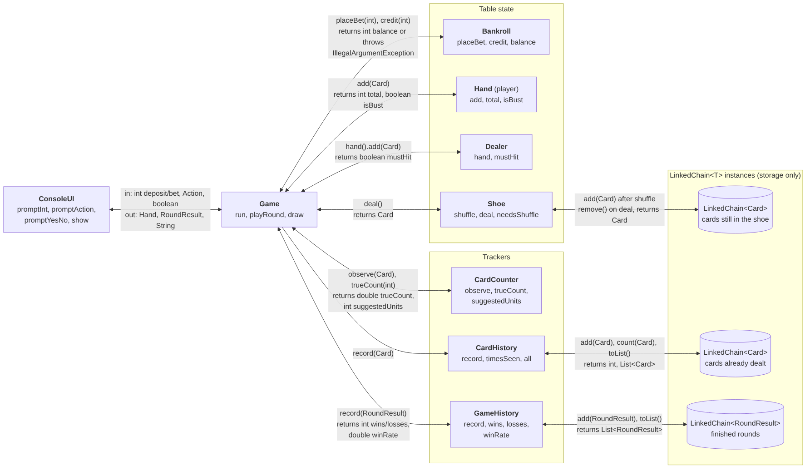

# Blackjack: Project Specification

This document turns our scope into a blueprint a teammate or a coding assistant can build from. The game is written in Java. The one stretch goal we are carrying into the build is the card counting helper; the other stretch goals from the scope are dropped (see Revised scope).

The game, in one paragraph: a console Blackjack table. The player deposits money, bets, and is dealt two cards face up while the dealer shows one card. The player hits, stands, or doubles down. The dealer then plays by a fixed rule (hit below 17, stand at 17 or more). A win pays 1:1, a two-card 21 pays 3:2, a tie returns the bet. Every card dealt is remembered, every finished round is remembered, and a running Hi-Lo count tells the player when the shoe favours them.

## 1. Class design

One class, one job. The table lists every class, what it owns, and what it is forbidden to do.

| Class | Its one job | What it does not do |
|---|---|---|
| `LinkedChain<T>` | Store entries of type `T` in a singly linked chain: add, remove, count, list. | No shuffling, no card logic, no money logic. |
| `Card` (record) | Hold one rank and one suit and report its Blackjack value. | Does not know about hands or totals. |
| `Rank`, `Suit` (enums) | Name the 13 ranks (with their point values) and 4 suits. | Nothing else. |
| `Shoe` | Build three decks, shuffle them into a `LinkedChain<Card>`, deal one card at a time, say when it is time to reshuffle. | Does not record history or count cards. |
| `Hand` | Hold the cards one participant currently has and compute the Blackjack total, with aces counted as 11 or 1. | Does not decide whether to hit. |
| `Dealer` | Own the dealer's `Hand` and apply the house rule: hit while the total is under 17. | Does not deal cards to itself; `Game` draws them. |
| `Bankroll` | Hold the player's balance and enforce the money rules (positive deposit, bet between 1 and the balance). | Does not know what a round is. |
| `RoundResult` (record) | Describe one finished round: round number, outcome, bet, net change, both totals. | Immutable; no behaviour beyond accessors. |
| `GameHistory` | Keep every `RoundResult` in a `LinkedChain<RoundResult>` and report wins, losses, pushes, win rate, net profit. | Does not settle bets. |
| `CardHistory` | Keep every card dealt since the last shuffle in a `LinkedChain<Card>` and answer "how many times has this card been seen". | Does not compute the count. |
| `CardCounter` | Maintain the Hi-Lo running count, convert it to a true count, and suggest a bet size in units. | Does not store cards; it is fed one card at a time. |
| `ConsoleUI` | Read lines from the keyboard, turn them into typed values (`int`, `Action`, `boolean`), re-prompt on unparseable text, and print whatever `Game` hands it. | Does not know the rules of Blackjack. |
| `Game` | Run the session: deposit, rounds, settlement, end when the balance is zero or the player quits. It is the only class that calls more than two others. | Does not store anything long-lived itself; it delegates to the classes above. |
| `Action`, `Outcome` (enums) | Name the player's choices (`HIT`, `STAND`, `DOUBLE`) and the five round outcomes (`BLACKJACK`, `WIN`, `PUSH`, `LOSS`, `BUST`). | Nothing else. |

The `LinkedChain` appears three times at run time: one instance holds the undealt cards inside `Shoe`, one holds the dealt cards inside `CardHistory`, and one holds finished rounds inside `GameHistory`. The chain is told to add, remove, and list. Every decision about what to add and when is made by the class that owns the instance.

### Why we split it this way

The scope named two things the chain must hold, cards and round results, so the chain had to be generic and the two owners had to be separate classes. From there the split follows the bad-input list: each rule has exactly one home. Money rules live in `Bankroll` because every path that touches the balance (deposit, bet, double down, payout) goes through that class, so a check placed there cannot be bypassed by a new caller. Text parsing lives in `ConsoleUI` because a non-numeric bet is a keyboard problem, and the same `promptInt` serves deposits, bets, and anything we add later.

Two alternatives we rejected:

1. **A single `Player` class holding the hand, the balance, and the history.** We rejected it because it would have three reasons to change (a new table rule, a new money rule, a new statistic), and because the dealer also needs a `Hand`, which would have meant duplicating the total-with-aces code or inheriting from `Player`, which misdescribes a dealer.
2. Putting a `shuffle()` method on `LinkedChain`, which was the scope's open question. Shuffling a linked chain in place means either O(n²) swaps by index or copying to an array anyway. `Shoe.shuffle()` builds the 156 cards in an `ArrayList`, calls `Collections.shuffle`, then adds each card to a cleared chain. The chain stays storage-only and the randomness lives in the class that owns the deck.

## 2. System diagram



Reading the diagram left to right: keyboard input enters through `ConsoleUI` as typed values, `Game` drives one round at a time, the four boxes in the middle hold the state of the table, the three trackers remember what happened, and the three cylinders on the right are the `LinkedChain` instances. Each arrow is labelled with the method called and the value that comes back. Cards enter a chain in `Shoe.shuffle()` and leave it in `Shoe.deal()`; the same `Card` object is then added to the `CardHistory` chain and shown to the `CardCounter`. Round results enter the third chain once per round and come back out as a `List<RoundResult>` when the player asks to review.

The diagram source is in `Docs/system-diagram.mmd` (Mermaid) and renders on GitHub if the PNG is ever stale.

## 3. The generic contract

```java
public class LinkedChain<T>
```

The type parameter `T` is unbounded. The chain promises three things about `T`:

1. **It stores exactly the type it was declared with.** A `LinkedChain<Card>` accepts a `Card` and returns a `Card`; the compiler rejects `shoeChain.add(someRoundResult)`.
2. **It never asks `T` to do anything except `equals`.** `contains(T)`, `count(T)` and `remove(T)` compare entries with `anEntry.equals(current.data)`. Every other method moves nodes without looking inside them.
3. **It never stores `null`.** `add(null)` throws, so `remove()` returning `null` means exactly one thing: the chain was empty.

Which operations are type-safe: all of them. `add(T)` takes a `T`, so a wrong-type argument is a compile error. `remove()` returns `T`, so the caller gets a `Card` or a `RoundResult` with no cast. `contains(T)`, `count(T)` and `remove(T)` take `T` rather than `Object`, so asking a card chain whether it contains a round result is also a compile error. `toList()` returns `List<T>`, and the implementation builds an `ArrayList<T>` with `add`, so there is no array creation and therefore no unchecked cast anywhere in the class. The nested `Node` is a private inner class that uses the outer `T`, so its `data` field is typed `T` as well.

### Why no bound

The two element types we store share no useful interface. `Card` could implement `Comparable<Card>`, but `RoundResult` has no natural order (which is larger, a push or a loss?), and nothing in the game ever sorts a chain or asks for a maximum. A `T extends Comparable<T>` bound would force `RoundResult` to implement a `compareTo` that nothing calls. Equality is already available on every object, and both of our element types are Java records, so `equals` compares fields rather than identity: two `Card(ACE, SPADES)` objects from different decks are equal, which is what `count` needs when the shoe holds three of them.

## 4. Data and state

### Inside `LinkedChain<T>`

```java
private Node firstNode;        // the most recently added entry; null when empty
private int  numberOfEntries;  // kept in step by add, remove, clear

private class Node {
    private T    data;
    private Node next;         // null for the last node
}
```

There is no tail reference. Every add goes to the head and `remove()` takes from the head, so the chain never needs to reach its far end in O(1). A tail would add one field and one branch to every mutating method for a benefit no caller uses. Size is a counter, incremented in `add`, decremented in both `remove` methods, zeroed in `clear`, so `size()` is O(1) instead of a walk.

### Application classes

| Class | Fields and types |
|---|---|
| `Card` | `Rank rank`, `Suit suit` (record components) |
| `Rank` | enum constants `TWO`..`TEN`, `JACK`, `QUEEN`, `KING`, `ACE`; field `int value` (2..10, face cards 10, ace 11) |
| `Suit` | enum constants `CLUBS`, `DIAMONDS`, `HEARTS`, `SPADES` |
| `Shoe` | `LinkedChain<Card> cards`; `int deckCount` (3); `Random rng`; `static final int CUT_CARD = 32` |
| `Hand` | `List<Card> cards` (an `ArrayList`) |
| `Dealer` | `Hand hand` |
| `Bankroll` | `int balance` (whole dollars) |
| `RoundResult` | `int roundNumber`, `Outcome outcome`, `int bet`, `int netChange`, `int playerTotal`, `int dealerTotal` (record components) |
| `GameHistory` | `LinkedChain<RoundResult> rounds` |
| `CardHistory` | `LinkedChain<Card> seen` |
| `CardCounter` | `int runningCount`; `int cardsSeen` |
| `ConsoleUI` | `Scanner in`; `PrintStream out` |
| `Game` | `Shoe shoe`; `Dealer dealer`; `Hand playerHand`; `Bankroll bankroll`; `GameHistory history`; `CardHistory cardHistory`; `CardCounter counter`; `ConsoleUI ui`; `int roundNumber` |

Money is an `int` of whole dollars. A 3:2 payout on an odd bet is computed with integer division (`bet * 3 / 2`), so a 5 dollar blackjack pays 7. We chose this over storing cents because every prompt and message then stays in whole numbers, and the half-dollar lost on an odd bet is the only place the simplification shows.

The cut card is 32 because that is the smallest number that guarantees a round can never run the shoe dry. In a three-deck shoe the longest hand that does not bust is 16 cards (twelve aces counted as 1 each, then four twos, total 20), and the dealer's longest hand is 15 (twelve aces, then three twos reaches 18 and the rule says stand). Those two hands overlap in the aces they would need, so 31 is a loose upper bound, and we reshuffle between rounds whenever fewer than 32 cards remain.

## 5. Method signatures and Big-O

`n` is the number of entries in the chain being operated on. `k` is the number of cards in one hand, which the cut-card arithmetic above bounds at 16, so anything linear in `k` is effectively constant.

### `LinkedChain<T>` public API

| Signature | Behaviour (including edge cases) | Big-O and why |
|---|---|---|
| `boolean add(T newEntry)` | Puts `newEntry` at the head; returns `true`. Throws `NullPointerException` if `newEntry` is null. | O(1): one node allocation, two reference writes, one increment. |
| `T remove()` | Removes and returns the head entry. Returns `null` if the chain is empty. | O(1): rewires `firstNode` to its `next`. |
| `boolean remove(T anEntry)` | Removes one entry equal to `anEntry` and returns `true`; returns `false` if none is found or the chain is empty. | O(n): walks until `equals` matches; worst case reads every node. |
| `boolean contains(T anEntry)` | `true` if some entry equals `anEntry`; `false` otherwise, including on an empty chain. | O(n): same walk, stops at first match. |
| `int count(T anEntry)` | Number of entries equal to `anEntry`; 0 on an empty chain. | O(n): must visit every node because duplicates can be anywhere. |
| `int size()` | Number of entries. | O(1): returns the counter. |
| `boolean isEmpty()` | `true` when `size()` is 0. | O(1). |
| `void clear()` | Drops every entry; `size()` becomes 0. | O(1): sets `firstNode` to null; the garbage collector does the rest. |
| `List<T> toList()` | A new `ArrayList<T>` with every entry, head first. An empty chain returns an empty list, never null. | O(n): one visit per node, each an amortised O(1) list add. |

**Changes from the LinkedChain we were given.** [Check these three against your copy of the starter file and delete any that already match.]

1. `toArray()` returning `T[]` is replaced by `toList()` returning `List<T>`. The array version needs `(T[]) new Object[n]`, an unchecked cast, which the generic contract above forbids.
2. `getCurrentSize()` is renamed `size()` and `getFrequencyOf()` is renamed `count()`, to match the names used in the assignment instructions.
3. `add` rejects null (the starter accepted it), so that `remove()` returning null is unambiguous.

### Application classes

| Signature | Behaviour | Big-O and why |
|---|---|---|
| **`Card`** | | |
| `int value()` | Point value: 2..10 by rank, 10 for J/Q/K, 11 for an ace. | O(1): reads the enum field. |
| `boolean isAce()` | `rank == Rank.ACE`. | O(1). |
| `String toString()` | e.g. `"A♠"`, `"10♥"`. | O(1). |
| **`Shoe`** | | |
| `Shoe(int deckCount, Random rng)` | Builds and shuffles `deckCount` decks. Throws `IllegalArgumentException` if `deckCount < 1`. | O(n) where n = 52·deckCount: the shuffle below. |
| `void shuffle()` | Clears the chain, builds all 52·deckCount cards into an `ArrayList`, `Collections.shuffle`s it, adds each card to the chain. | O(n): the Fisher-Yates shuffle inside `Collections.shuffle` is O(n) on a `RandomAccess` list, and the n adds are O(1) each. |
| `Card deal()` | Removes and returns the head card. Throws `IllegalStateException("shoe is empty")` if none remain. | O(1): one `remove()`. |
| `int cardsRemaining()` | `cards.size()`. | O(1). |
| `boolean needsShuffle()` | `cardsRemaining() < CUT_CARD`. | O(1). |
| **`Hand`** | | |
| `void add(Card c)` | Appends to the list. Throws `NullPointerException` on null. | O(1) amortised: `ArrayList.add`. |
| `int total()` | Sum of values; while the sum exceeds 21 and an ace is still counted as 11, count that ace as 1 instead. An empty hand totals 0. | O(k): one pass to sum, then at most one demotion per ace. |
| `boolean isSoft()` | `true` if an ace is currently counted as 11. | O(k). |
| `boolean isBust()` | `total() > 21`. | O(k). |
| `boolean isBlackjack()` | Exactly two cards and `total() == 21`. | O(1): size check then a two-card sum. |
| `int size()` | Number of cards. | O(1). |
| `List<Card> cards()` | Unmodifiable view of the cards. | O(1): `Collections.unmodifiableList` wraps without copying. |
| `void clear()` | Empties the hand for the next round. | O(k): `ArrayList.clear` nulls each slot, and k is at most 16. |
| **`Dealer`** | | |
| `Hand hand()` | The dealer's hand. | O(1). |
| `boolean mustHit()` | `hand.total() < 17`. Stands on every 17, soft or hard. | O(k). |
| **`Bankroll`** | | |
| `Bankroll(int initialDeposit)` | Sets the balance. Throws `IllegalArgumentException("deposit must be greater than zero")` if `initialDeposit <= 0`. | O(1). |
| `void deposit(int amount)` | Adds to the balance. Same exception on `amount <= 0`. | O(1). |
| `int placeBet(int amount)` | Subtracts `amount` and returns it. Throws `IllegalArgumentException("bet must be greater than zero")` on `amount <= 0`, or `IllegalArgumentException("bet exceeds balance of $X")` on `amount > balance`. | O(1). |
| `void credit(int amount)` | Adds a payout. Throws `IllegalArgumentException` on `amount < 0`; 0 is allowed (a loss credits nothing). | O(1). |
| `int balance()` | Current balance. | O(1). |
| `boolean isBroke()` | `balance == 0`. | O(1). |
| **`GameHistory`** | | |
| `void record(RoundResult r)` | `rounds.add(r)`. | O(1). |
| `int rounds()` | `rounds.size()`. | O(1). |
| `int wins()` | Count of results whose outcome is `WIN` or `BLACKJACK`; 0 when empty. | O(n): walks `toList()`. |
| `int losses()` | Count of `LOSS` or `BUST`; 0 when empty. | O(n). |
| `int pushes()` | Count of `PUSH`; 0 when empty. | O(n). |
| `double winRate()` | `wins() / rounds()` as a fraction; returns 0.0 when no rounds (never divides by zero). | O(n). |
| `int netProfit()` | Sum of `netChange` over all results; 0 when empty. | O(n). |
| `List<RoundResult> all()` | `rounds.toList()`. | O(n). |
| **`CardHistory`** | | |
| `void record(Card c)` | `seen.add(c)`. | O(1). |
| `int timesSeen(Card c)` | `seen.count(c)`; 0 if never dealt. | O(n). |
| `int size()` | Cards dealt since the last shuffle. | O(1). |
| `List<Card> all()` | `seen.toList()`. | O(n). |
| `void clear()` | Forgets everything; called on reshuffle. | O(1). |
| **`CardCounter`** | | |
| `void observe(Card c)` | Hi-Lo: ranks 2..6 add 1, 7..9 add 0, 10/J/Q/K/A subtract 1; `cardsSeen++`. | O(1). |
| `int runningCount()` | The raw count. | O(1). |
| `double trueCount(int cardsRemaining)` | `runningCount / max(0.5, cardsRemaining / 52.0)`. The 0.5 floor stops the division inflating the count below half a deck, which is roughly where our cut card falls (32 cards is 0.6 decks). | O(1). |
| `int suggestedUnits(int cardsRemaining)` | 1 when the true count is below 2; otherwise `floor(trueCount) - 1`. The bet grows one unit per point of true count above 1, the ramp counting guides describe as "true count minus one". | O(1). |
| `String advice(int cardsRemaining)` | A one-line message with the running count, true count and suggested units. | O(1). |
| `void reset()` | Zeroes both fields; called on reshuffle. | O(1). |
| **`ConsoleUI`** | | |
| `int promptInt(String prompt)` | Prints the prompt, reads a line, returns it as an `int`. On `NumberFormatException` prints `"Please enter a whole number."` and asks again. Never returns until it has an `int`. | O(1) per attempt; unbounded attempts by design. |
| `Action promptAction(boolean canDouble)` | Accepts `hit`/`h`, `stand`/`s`, and `double`/`d` only when `canDouble`; case-insensitive, surrounding spaces ignored. Anything else prints the accepted words and asks again. | O(1) per attempt. |
| `boolean promptYesNo(String prompt)` | Accepts `y`/`yes`/`n`/`no`; re-prompts otherwise. | O(1) per attempt. |
| `void show(String message)` | Prints one line. | O(1). |
| `void showHand(String owner, Hand hand, boolean hideSecond)` | Prints the owner's cards and total; with `hideSecond` the dealer's second card prints as `??` and no total. | O(k). |
| `void showRound(RoundResult r)` | Prints outcome, bet, net change, both totals. | O(1). |
| `void showHistory(GameHistory h)` | Prints every round, then wins, losses, pushes, win rate, net profit. | O(n). |
| **`Game`** | | |
| `void run()` | Prompts for a deposit (re-prompting through `Bankroll`'s exception), then plays rounds until `bankroll.isBroke()` or the player answers no to "play another round?", then prints the history. | O(r · n) over a session of r rounds, from the per-round history summary; everything else per round is O(1). |
| `RoundResult playRound()` | Reshuffles if `shoe.needsShuffle()` (and resets the counter and card history); shows the counter's advice; takes the bet; deals two cards each; checks for blackjack; runs the player's turn (hit, stand, double); runs the dealer's turn; settles; records and returns the `RoundResult`. | O(k) for the hands plus the O(1) calls; the history record is O(1). |
| `static void main(String[] args)` | Builds the collaborators with a `new Random()` and three decks and calls `run()`. | O(n) for the initial shuffle. |

`Game.draw()` is private: it calls `shoe.deal()`, then `cardHistory.record(card)`, then `counter.observe(card)`, and returns the card. Every card dealt in the program goes through this one method, which is how the history and the counter are guaranteed to see the same cards the players do.

Settlement in `playRound`, with `bet` already subtracted by `placeBet`:

| Outcome | When | `credit` | `netChange` |
|---|---|---|---|
| `BLACKJACK` | Player's first two cards total 21 and the dealer's do not | `bet + bet * 3 / 2` | `+bet * 3 / 2` |
| `BUST` | Player's total exceeds 21 (dealer does not draw) | 0 | `-bet` |
| `WIN` | Dealer busts, or player's total is higher | `2 * bet` | `+bet` |
| `PUSH` | Totals equal, or both have blackjack | `bet` | 0 |
| `LOSS` | Dealer's total is higher | 0 | `-bet` |

After a double down, `bet` in this table is the doubled amount.

## 6. Where validation lives

Each row is one bad input from the scope. The check is placed in the class that owns the fact being checked, so that the rule has one home and cannot be bypassed by a second caller.

| Bad input | Caught by | Response | Why there |
|---|---|---|---|
| Bet of zero or a negative number | `Bankroll.placeBet` | Throws `IllegalArgumentException("bet must be greater than zero")`. `Game.playRound` catches it, passes the message to `ui.show`, and calls `promptInt` again. | Only `Bankroll` knows the balance, and the same method handles the second bet of a double down, so the rule is written once. |
| Bet larger than the balance | `Bankroll.placeBet` | Throws `IllegalArgumentException("bet exceeds balance of $X")`; same catch-and-re-prompt in `Game`. | Same reason. |
| Deposit of zero or a negative number | `Bankroll(int)` constructor and `Bankroll.deposit` | Throws `IllegalArgumentException("deposit must be greater than zero")`; `Game.run` catches and re-prompts. | The balance is private to `Bankroll`; a check anywhere else would be checking a number it does not own. |
| Non-numeric text where a number is expected (`"ten"`, `""`, `"5.5"`) | `ConsoleUI.promptInt` | Catches `NumberFormatException`, prints `"Please enter a whole number."`, re-prompts. Loops until an `int` arrives. | The text has not become a number yet, so no other class can see it. One method serves deposits and bets. |
| Something other than hit/stand/double at the action prompt | `ConsoleUI.promptAction` | Prints `"Type hit, stand" + (canDouble ? " or double" : "")` and re-prompts. | Same: it is a parsing failure. |
| `double` typed when it is not allowed (more than two cards, or balance below the bet) | `Game.playRound` computes `canDouble` and passes it to `promptAction`, which then treats `double` as unrecognised | Re-prompt with the message above, without the word `double`. If a caller bypassed the flag, `Bankroll.placeBet` would still throw on the second bet. | `Game` is the only class that knows both the hand size and the balance. |
| Hitting when no cards remain | Prevented in `Game.playRound` by `shoe.needsShuffle()` at the start of every round; guarded in `Shoe.deal()` | `playRound` reshuffles before the bet is taken, so a player can never hit into an empty shoe. `Shoe.deal()` on an empty chain throws `IllegalStateException("shoe is empty")`, which is left uncaught because reaching it means the cut-card arithmetic is wrong and the program should stop loudly rather than deal nothing. | The shoe owns the cards and the cut card; the round loop owns the moment to reshuffle. |
| Balance reaches zero | `Game.run` checks `bankroll.isBroke()` after each round | Prints `"You are out of money."`, prints the history, ends the session. There is no mid-game deposit; the scope says a player with no money cannot play. | Only `Game` knows whether a round is in progress, so only it can end the session between rounds. |
| `add(null)` on any chain | `LinkedChain.add` | Throws `NullPointerException` via `Objects.requireNonNull`. | A null entry would break `equals` in `contains`, `count`, and `remove(T)`, and would make `remove()`'s null-means-empty promise false. |
| `remove(T)` of an entry that is not there | `LinkedChain.remove(T)` | Returns `false`; nothing changes. | Absence is an ordinary answer. An exception would force every caller to call `contains` first and walk the chain twice. |
| `remove()` on an empty chain | `LinkedChain.remove()` | Returns `null`. `Shoe.deal()` converts that into the `IllegalStateException` above. | `Shoe` knows that an empty shoe mid-round is an error; the chain has no way to know that. |

## 7. Test plan

One normal case and one bad-input case per public method. Setups: "empty chain" is `new LinkedChain<Card>()`; "A♠, A♠, K♥" is a chain built by adding those three in that order, so K♥ is at the head.

### `LinkedChain<T>`

| Method | Normal case | Bad input or edge case |
|---|---|---|
| `add` | Add A♠ to an empty chain. `size()` is 1, `contains(A♠)` is true. | Add `null`. `NullPointerException`; `size()` stays 0. |
| `remove()` | Chain A♠, A♠, K♥. Returns K♥; `size()` is 2. | Empty chain. Returns `null`; `size()` stays 0. |
| `remove(T)` | Chain A♠, A♠, K♥; `remove(A♠)`. Returns true; `count(A♠)` is 1; `size()` is 2. | Chain A♠, A♠, K♥; `remove(Q♦)`. Returns false; `size()` still 3. Also: empty chain, `remove(A♠)` returns false. |
| `contains` | Chain A♠, A♠, K♥; `contains(K♥)`. True. | Empty chain; `contains(K♥)`. False. |
| `count` | Chain A♠, A♠, K♥; `count(A♠)`. 2. | Chain A♠, A♠, K♥; `count(Q♦)`. 0. |
| `size` | After three adds. 3. | Empty chain. 0. |
| `isEmpty` | Empty chain. True. | After one add then one `remove()`. True (back to empty, counter did not drift). |
| `clear` | Chain of 3; `clear()`. `size()` 0, `isEmpty()` true. | `clear()` on an empty chain. No exception, still empty. |
| `toList` | Chain A♠, A♠, K♥. List of length 3 starting with K♥. | Empty chain. An empty list, not null. |

### `Shoe`

| Method | Normal case | Bad input or edge case |
|---|---|---|
| constructor / `shuffle` | `new Shoe(3, new Random(42))`. `cardsRemaining()` is 156; `toList()` of the chain contains each of the 52 distinct cards exactly 3 times; two shoes with different seeds deal different first cards. | `new Shoe(0, rng)`. `IllegalArgumentException`. |
| `deal` | Fresh shoe; `deal()`. A non-null `Card`; `cardsRemaining()` is 155. | Deal 156 times then once more. The 157th call throws `IllegalStateException`. |
| `cardsRemaining` | After 10 deals from 156. 146. | After 156 deals. 0. |
| `needsShuffle` | 156 remaining. False. | 31 remaining. True. 32 remaining: false (boundary). |

### `Hand`

| Method | Normal case | Bad input or edge case |
|---|---|---|
| `add` | Add 7♣ to an empty hand. `size()` 1. | Add `null`. `NullPointerException`. |
| `total` | A♠, 9♦. 20. | A♠, 9♦, 5♣. 15 (ace demoted to 1). A♠, A♦. 12. Empty hand. 0. |
| `isSoft` | A♠, 6♦. True. | A♠, 6♦, 9♣. False (ace now 1). |
| `isBust` | 10♠, 9♦, 5♣. True. | 10♠, 9♦, 2♣. False (exactly 21). |
| `isBlackjack` | A♠, K♦. True. | 7♠, 7♦, 7♣. False (21 with three cards). |
| `cards` | Hand with two cards. List of length 2. | Call `.add(...)` on the returned list. `UnsupportedOperationException`. |
| `clear` | Hand of three; `clear()`. `size()` 0, `total()` 0. | `clear()` on an empty hand. Still 0, no exception. |

### `Dealer`

| Method | Normal case | Bad input or edge case |
|---|---|---|
| `mustHit` | Hand 10♠, 6♦ (16). True. | Hand A♠, 6♦ (soft 17). False. Empty hand: true (0 < 17), which is why `Game` deals before asking. |

### `Bankroll`

| Method | Normal case | Bad input or edge case |
|---|---|---|
| constructor | `new Bankroll(100)`. `balance()` 100. | `new Bankroll(-5)` or `new Bankroll(0)`. `IllegalArgumentException`. |
| `deposit` | Balance 100; `deposit(50)`. 150. | `deposit(0)`. Exception; balance unchanged. |
| `placeBet` | Balance 100; `placeBet(30)`. Returns 30; balance 70. | `placeBet(130)`. Exception with message naming 100; balance still 100. `placeBet(-1)`: exception. |
| `credit` | Balance 70; `credit(60)`. 130. | `credit(-10)`. Exception. `credit(0)`: allowed, balance unchanged. |
| `isBroke` | Balance 100; `placeBet(100)`. True. | Balance 1. False. |

### `GameHistory`

| Method | Normal case | Bad input or edge case |
|---|---|---|
| `record` / `rounds` | Record one result. `rounds()` 1. | Record the same `RoundResult` twice (a duplicate). `rounds()` 2; duplicates are allowed. |
| `wins` | Record WIN, BLACKJACK, LOSS. 2. | Empty history. 0. |
| `losses` | Record LOSS, BUST, PUSH. 2. | Empty history. 0. |
| `pushes` | Record PUSH, WIN. 1. | Empty history. 0. |
| `winRate` | WIN, LOSS, LOSS, PUSH. 0.25. | Empty history. 0.0, no `ArithmeticException`. |
| `netProfit` | +10, -10, +15. 15. | Empty history. 0. |
| `all` | Three results. List of three. | Empty history. Empty list. |

### `CardHistory`

| Method | Normal case | Bad input or edge case |
|---|---|---|
| `record` / `size` | Record K♥. `size()` 1. | Record K♥ three times (three decks). `size()` 3. |
| `timesSeen` | Record K♥, K♥. `timesSeen(K♥)` 2. | `timesSeen(2♣)` never recorded. 0. |
| `all` | Two recorded. List of two. | Empty history. Empty list. |
| `clear` | After records, `clear()`. `size()` 0. | `clear()` on empty. Still 0. |

### `CardCounter`

| Method | Normal case | Bad input or edge case |
|---|---|---|
| `observe` / `runningCount` | Observe 5♣, K♥, 8♦. Count +1 -1 +0 = 0. Observe 2♠, 3♠: +2. | Observe an ace. -1 (ace counts as a high card, not 0). |
| `trueCount` | Running +6 with 104 cards left (2 decks). 3.0. | Running +4 with 10 cards left. 4 / 0.5 = 8.0, using the half-deck floor rather than 4 / 0.19 = 20.8. |
| `suggestedUnits` | True count 4 (e.g. +8 at 104 cards). 3 units. | True count 1.5 (e.g. +3 at 104 cards). 1 unit. True count -3: still 1, never 0 or negative. |
| `advice` | Any state. A non-empty string containing the running count. | After `reset()`. Mentions a count of 0 and 1 unit. |
| `reset` | After observing ten cards, `reset()`. `runningCount()` 0. | `reset()` on a fresh counter. Still 0, no exception. |

### `ConsoleUI` (tested with a `Scanner` over a prepared string)

| Method | Normal case | Bad input or edge case |
|---|---|---|
| `promptInt` | Input `"25\n"`. Returns 25. | Input `"ten\n\n5.5\n25\n"`. Prints the whole-number message three times, returns 25. |
| `promptAction` | Input `"HIT\n"`, `canDouble` true. `Action.HIT`. | Input `"double\nsplit\n s \n"`, `canDouble` false. Re-prompts twice (the message omits `double`), returns `Action.STAND`. |
| `promptYesNo` | Input `"y\n"`. True. | Input `"maybe\nno\n"`. Re-prompts once, returns false. |
| `showHand` | Hand A♠, K♦, `hideSecond` false. Output contains `A♠`, `K♦` and `21`. | Same hand, `hideSecond` true. Output contains `A♠` and `??` and no total. |

### `Game` (driven with a seeded `Random` and scripted input)

| Method | Normal case | Bad input or edge case |
|---|---|---|
| `run` | Input: deposit 100, bet 10, stand, no. One `RoundResult` is in the history. Play the seed once by hand, record the final balance, and assert that value on every later run. | Input: deposit `-50`, then `100`. The deposit message prints once and the game proceeds with 100. Input: deposit 10, bet 10, a losing seed. Prints "You are out of money." and the history, and exits without asking to play again. |
| `playRound` | Seed where the player is dealt A♠, K♦ and the dealer is not. Outcome `BLACKJACK`, net +15 on a bet of 10. | Shoe set to 31 remaining before the round. The round begins with a reshuffle: `cardsRemaining()` is 156 minus the cards dealt, `CardHistory.size()` equals the cards dealt this round, counter reset to 0 before observing them. |

## 8. Revised scope

| Change | Why | Origin |
|---|---|---|
| "hold or stand" in the scope paragraph becomes "hit or stand". | Typo; the MVP list already said hit. | Own reflection |
| The deck is a three-deck shoe of 156 cards, not a single 52-card deck. | The scope said both. Three decks is the version that gives the chain its duplicates and makes counting worth doing; one deck would be reshuffled almost every round. | Group discussion |
| Card counting is the one stretch goal we build. ASCII card art, splitting pairs, the cheating dealer, and multiple players are dropped. | We have time for one. Counting touches only `CardCounter` and one line in `Game.draw()`, so it is the cheapest to add to a working MVP. Splitting would change `Hand`, `Bankroll` and the settlement table; multiple players would change almost every class. | Group discussion |
| The counting method is Hi-Lo (2..6 count +1, 7..9 count 0, 10..A count -1) with a true count and a "true count minus one" bet ramp. | The scope said we had not studied the mathematics yet. Hi-Lo is a balanced count, meaning the plus and minus cards cancel over a full deck so the running count starts and ends each shoe at zero, and it needs one integer of state. | GenAI, during drafting of this spec |
| Payouts (1:1, 3:2 on blackjack, push returns the bet) and double down are listed as MVP, not stretch. | The scope's first paragraph promised them, and the money rules in the MVP list are meaningless without a payout rule. Double down is one extra branch in the player turn. | Own reflection |
| A third `LinkedChain` instance, `CardHistory`, holds the dealt cards. | The scope's MVP already required "every card that has been used" to be tracked; a chain stores it with the same `add` and `count` calls the shoe uses, and it is a third place where duplicates must be allowed. | GenAI, during drafting |
| Shuffling happens in an `ArrayList` before the cards are loaded into the chain; the chain has no `shuffle()`. | Resolves the scope's open question without putting application logic in the chain. | GenAI, during drafting; see Class design for the rejected alternative |
| A cut card at 32 remaining cards triggers a reshuffle between rounds. | Guarantees the "hit with no cards left" bad input can never reach the player. The number comes from the longest possible hands, computed in Data and state. | GenAI, during drafting |
| Money is whole dollars; a blackjack on an odd bet pays the floor of 1.5 times the bet. | Keeps every prompt an integer. | GenAI, during drafting |
| When the balance reaches zero the session ends and the history prints. | The scope said a player with no money cannot play; we read that as "the session is over" rather than "prompt for another deposit". | Own reflection |
| `toArray()` on the chain is replaced by `toList()`. | Removes the only unchecked cast, which the generic contract rubric forbids. | GenAI, during drafting |

## 9. Work attribution

[Fill in names. Every section needs at least one person. Rows marked "GenAI-drafted" were produced by a coding assistant from the scope document and the assignment instructions; the person named is responsible for reading, correcting and owning that section before submission.]

| Section | Team member(s) | Contribution (how) |
|---|---|---|
| Class design | [Name] | GenAI-drafted; [revised / reviewed by name] |
| System diagram | [Name] | GenAI-drafted in Mermaid, rendered to PNG; [checked against the method tables by name] |
| Generic contract | [Name] | GenAI-drafted; [reviewed by name] |
| Data and state | [Name] | GenAI-drafted; cut-card arithmetic [verified by hand by name] |
| Method signatures and Big-O | [Name] | GenAI-drafted; Big-O [verified by hand by name] |
| Where validation lives | [Name] | GenAI-drafted; [reviewed by name] |
| Test plan | [Name] | GenAI-drafted; [reviewed by name] |
| Revised scope | [Name] | Card-counting decision from group discussion; table GenAI-drafted; [reviewed by name] |
| Work attribution and GenAI reflection | [Name] | [Written by name] |

### How we used GenAI

We gave a coding assistant (Claude) our scope document and the assignment instructions and asked it to draft this specification, after we had decided as a group to build the card counting stretch goal. The assistant proposed the class split, the Hi-Lo counting method, the cut card value and its arithmetic, the `toList()` change to the chain, the exception messages, and the test cases. [State here what the team changed after reading the draft, and which Big-O estimates and test cases were checked by hand.] The scope document itself was written without GenAI.
